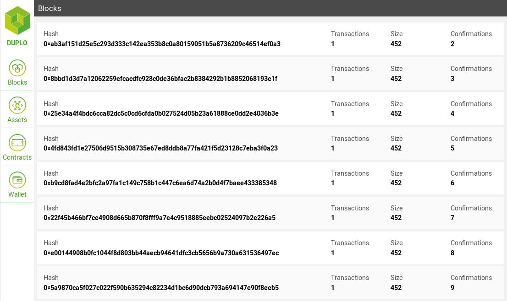

<h1 align="center">duplo</h1>

A frontend for your NEO private network.

`duplo` is meant to help interacting with your NEO private network. It's aims to provide similar features as [ganache](https://github.com/trufflesuite/ganache) does for Ethereum. It can be used as a tool for testing deployment and invocation of smart contracts, and help beginners by visualizing the blockchain.

## Getting Started

The project is currently under active development, as we are still working towards a first release.

If you want to check out the latest version anyway, you can run the [neo-dev-toolkit](https://github.com/effectai/neo-dev-toolkit). It sets up a NEO private network and adds `duplo` as a frontend.

## Features

The project aims to provide the features listed below. Currently only a small subset is implemented

- View blocks
- Manage wallet keys, make transactions and claim GAS
- List assets and create new assets
- List smart contracts and deploy new contracts
- Invoke smart contracts and display notifications
